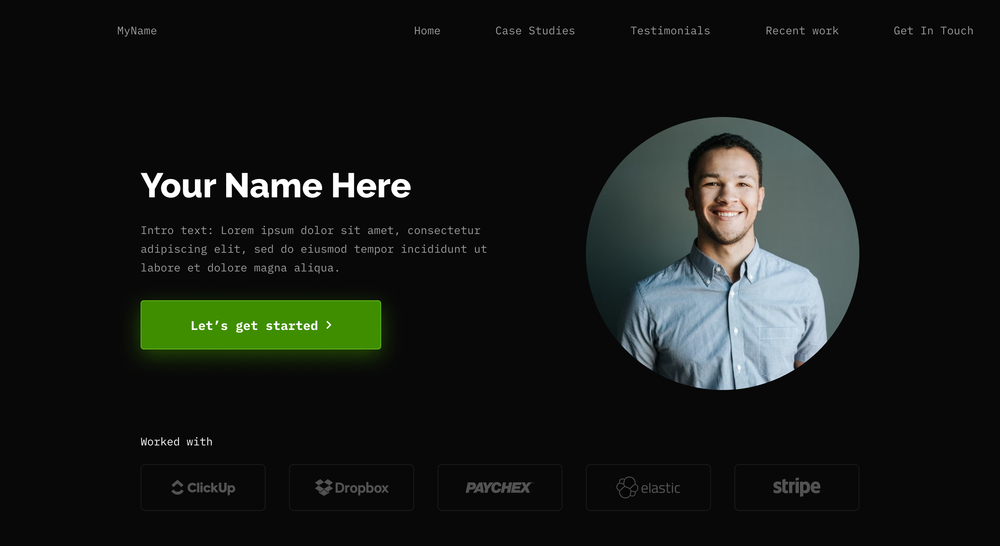
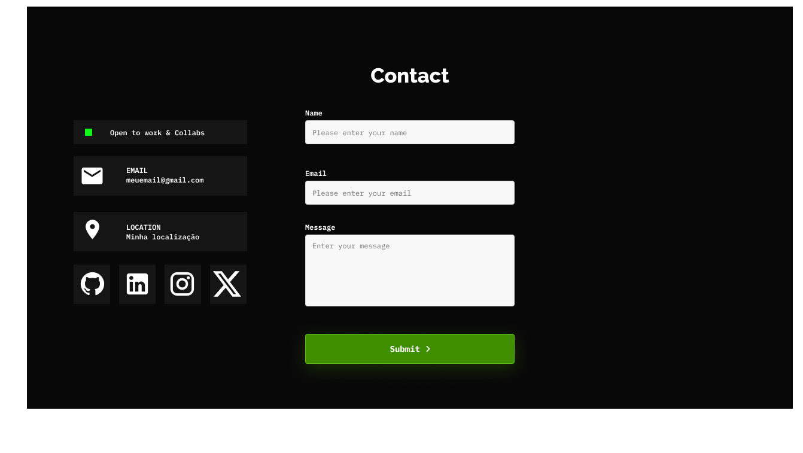
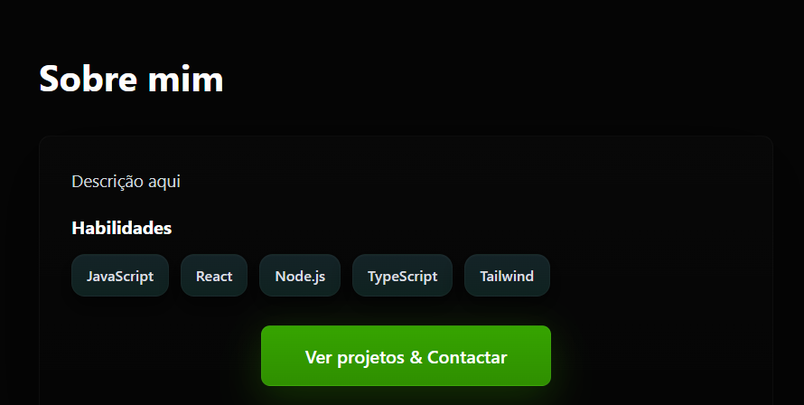
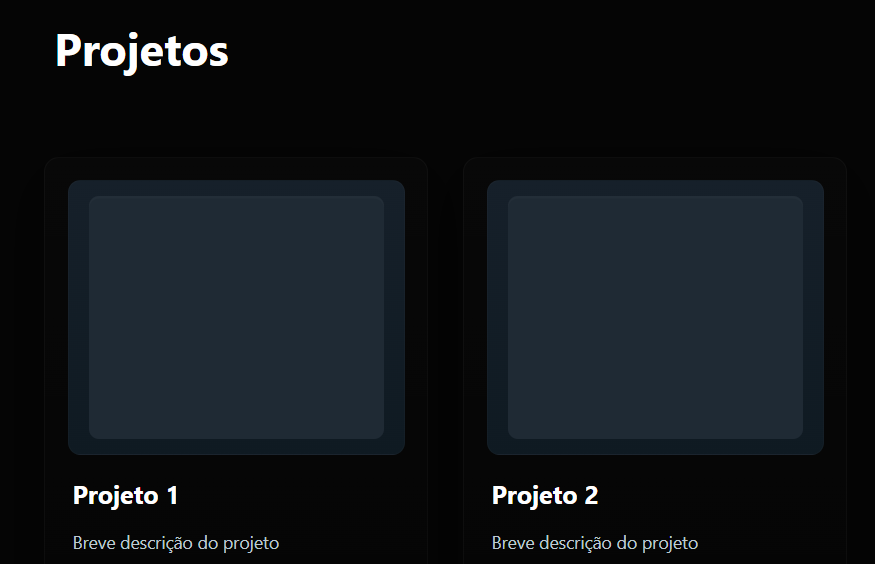
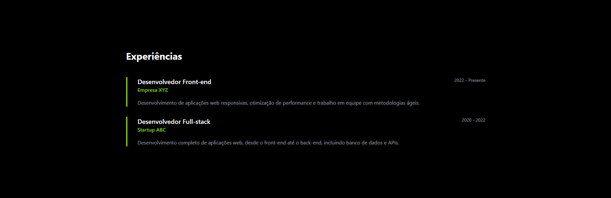

# Portfólio

## Descrição
Este projeto consiste no desenvolvimento de um portólio profissional onde será mostrado minha trajetória, habilidades, projetos e formas de contato de maneira moderna
e acessível.

## Integrantes
- Breno de Oliveira Brandão 
- Nicolas Almeida Prado da Silva	
- Pedro Augusto Santos Seabra	

## Professor
- João Paulo Carneiro Aramuni


## Tecnologias utilizadas
- Svelte, Vercel, Figma, GitHub
 
## Relação das dependências e bibliotecas/frameworks usados
- Svelte, Tailwind, Lucide, Daisyui


## Estrutura de diretórios do projeto
```
src/
  app.html
  app.css
  routes/
    +layout.svelte   ← layout base (header/nav/main/footer)
    +page.svelte     ← página inicial com seções: home, sobre, projetos, experiências, contato
  lib/
    
docs/
  images/ ← wireframes do portfólio

```

## Instruções de instalação e execução local
1. Clonar o repositório
2. Instalar dependências
   - `npm install`
3. Ambiente de desenvolvimento
   - `npm run dev`

## Wireframes no Figma

### Layout Principal

### Página contato

### Página Sobre mim

### Página Projetos

### Página Experiências



**Descrição:** Layout dark theme com hero section, navegação fixa e seções organizadas (Sobre mim, Projetos, Experiências, Contato).

## Publicação
- 

## Link do site 
- 